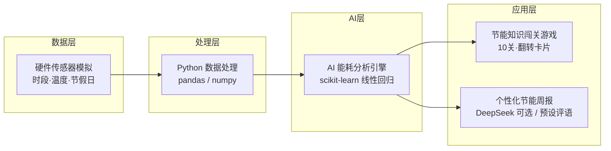
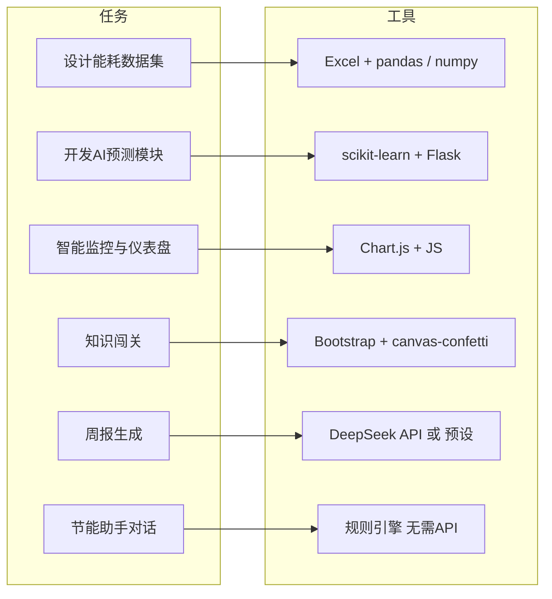
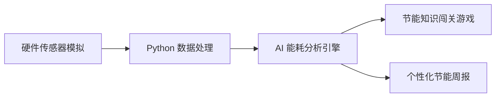

# EcoCampus AI · Mermaid 图代码

以下为作品框架与数据流对应的 Mermaid 代码，可复制到支持 Mermaid 的编辑器（如 Typora、VS Code 插件、GitHub/GitLab）中渲染。

---

## 图1：作品框架设计（对应方案文档流程图）

**说明**：硬件传感器模拟 → Python 数据处理 → AI 能耗分析引擎 → 闯关游戏 + 周报。



---

## 图2：系统架构图（含前端与节能助手）

**说明**：用户浏览器 → Flask 后端 → 三大 API 与对应模块 → 数据/外部服务。

```mermaid
flowchart TB
    subgraph 用户浏览器
        U[单页应用<br/>Bootstrap 5 · Chart.js · Glassmorphism]
    end

    subgraph 前端功能
        F1[智能监控区<br/>滑块·仪表盘]
        F2[节能知识闯关<br/>10关·翻转卡片]
        F3[节能助手对话<br/>规则匹配·气泡]
        F4[我的节能周报<br/>一键生成]
    end

    subgraph Flask后端
        API1[/api/predict]
        API2[/api/report]
        API3[/api/chat]
    end

    subgraph 后端模块
        M1[能耗预测模型<br/>scikit-learn 线性回归]
        M2[周报生成<br/>DeepSeek 可选 / 预设评语]
        M3[规则对话引擎<br/>多意图·多回复·无需 Key]
    end

    subgraph 数据与外部
        D[模拟数据集<br/>pandas · numpy]
        DS[DeepSeek API<br/>可选]
    end

    U --> F1 & F2 & F3 & F4
    F1 --> API1
    F4 --> API2
    F3 --> API3

    API1 --> M1
    API2 --> M2
    API3 --> M3

    M1 --> D
    M2 -.可选.-> DS
```

---

## 图3：数据流图（自上而下）

**说明**：从数据生成到前端展示的纵向数据流。

```mermaid
flowchart TD
    A[模拟数据集<br/>hour, temp, is_holiday → power] --> B[EnergyPredictor<br/>LinearRegression.fit]
    B --> C[/api/predict]
    C --> D[Chart.js 仪表盘<br/>半圆仪表·警告动画]

    E[闯关得分 score] --> F[/api/report]
    F --> G{DeepSeek Key?}
    G -->|有| H[DeepSeek 生成评语]
    G -->|无| I[本地预设评语随机]
    H & I --> J[周报弹窗展示]

    K[用户输入 message] --> L[/api/chat]
    L --> M[关键词匹配]
    M --> N[随机返回预设回复]
    N --> O[对话气泡展示]
```

---

## 图4：任务与工具支持（简图）

**说明**：各任务与所用工具的对应关系，用块状图表示。



---

## 图5：纯流程图（与图片方案一致）

**说明**：与「创意方案2」文档中流程图一一对应，仅三个主节点 + 双分支。



---

以上代码可直接复制使用。若在 Markdown 中渲染，需确保使用 ` ```mermaid ` 代码块（如已保留）。
